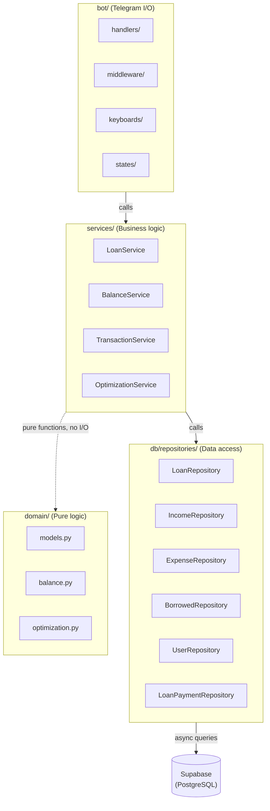
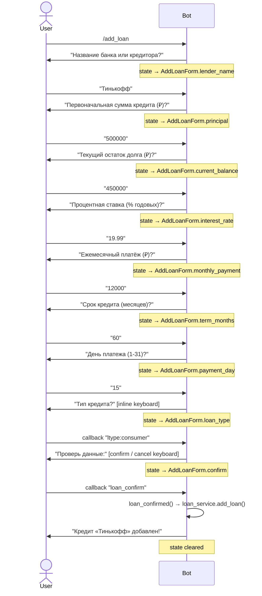

# Architecture

## Layer Overview

```
┌──────────────────────────────────────────────────────┐
│  bot/  (Telegram I/O)                                │
│    handlers/  keyboards/  states/  middleware/       │
└──────────────┬───────────────────────────────────────┘
               │ calls
┌──────────────▼───────────────────────────────────────┐
│  services/  (Business logic)                         │
│    LoanService  BalanceService  TransactionService   │
│    OptimizationService                               │
└──────────────┬───────────────────────────────────────┘
               │ calls
┌──────────────▼───────────────────────────────────────┐
│  db/repositories/  (Data access)                     │
│    LoanRepository  IncomeRepository  ...             │
└──────────────┬───────────────────────────────────────┘
               │ calls
┌──────────────▼───────────────────────────────────────┐
│  Supabase (PostgreSQL)                               │
└──────────────────────────────────────────────────────┘

┌──────────────────────────────────────────────────────┐
│  domain/  (Pure logic — no I/O, called by services)  │
│    models.py  balance.py  optimization.py            │
└──────────────────────────────────────────────────────┘
```

### Component Relationships



### FSM Conversation Flow: `/add_loan`



### Layer Responsibilities

| Layer | Does | Does NOT |
|---|---|---|
| `domain` | Immutable dataclasses, pure calculation functions | Any I/O, database calls |
| `db/repositories` | Async Supabase queries, maps raw rows → domain models, casts `numeric` → `Decimal` | Business rules |
| `services` | Validation, cross-repo orchestration, domain function calls | Telegram interaction |
| `bot` | Parse user input, call services, format responses | Business logic |

---

## Service Injection

Services are instantiated at startup and injected into aiogram's Dispatcher data dict:

```python
# app/bot/main.py (startup)
dp["loan_service"] = LoanService(loan_repo, payment_repo)
dp["balance_service"] = BalanceService(income_repo, expense_repo, loan_repo, borrowed_repo)
dp["transaction_service"] = TransactionService(income_repo, expense_repo, borrowed_repo)
dp["optimization_service"] = OptimizationService(loan_repo)
```

Handlers declare them as typed parameters — aiogram resolves from `dp` automatically:

```python
async def cmd_loans(message: Message, loan_service: LoanService) -> None:
    loans = await loan_service.get_all_active()
```

No DI framework needed; aiogram's middleware data dict is the container.

---

## Bot Startup Sequence (`app/bot/main.py → run_bot()`)

1. Create `Bot` with HTML parse mode
2. Create `Dispatcher` with `MemoryStorage` (in-memory FSM)
3. Register `OwnerMiddleware` on `.message` and `.callback_query`
4. Resolve `user_id`: `UserRepository.get_or_create(telegram_id)`
5. Instantiate repositories with `(client, user_id)`
6. Inject services into `dp` dict
7. Register all routers: `start`, `balance`, `loans`, `income`, `expense`, `borrowed`, `optimize`
8. Start polling

---

## FSM (Finite State Machine)

All multi-step conversations use `aiogram.fsm`. Storage is `MemoryStorage` — **all state is lost on bot restart**.

`Decimal` cannot be stored in `FSMContext` directly (it is not JSON-serialisable). Values are stored as `str` and cast back:

```python
# storing
await state.update_data(amount=str(amount))

# retrieving
data = await state.get_data()
amount = Decimal(data["amount"])
```

State groups live in `app/bot/states/forms.py`.

---

## Access Control

`OwnerMiddleware` (`app/bot/middleware/auth.py`) checks every incoming update:

```python
if user.id != settings.telegram_owner_id:
    return None   # silently drop — no response sent
```

It is applied to both `dispatcher.message` and `dispatcher.callback_query` before any handler runs.

The authorized Telegram user ID comes from the `TELEGRAM_OWNER_ID` environment variable.

---

## Data Flow Example: Record a Loan Payment

```
User: /pay_loan
  → cmd_pay_loan()
  → fetches active loans → shows inline keyboard

User: clicks loan button (callback "loan:uuid")
  → pay_loan_selected()
  → saves loan_id, default amount to FSM state
  → sets state = PayLoanForm.amount

User: sends "15000"
  → pay_loan_amount()
  → parses Decimal("15000")
  → calls loan_service.record_payment(loan_id, 15000, today)

LoanService.record_payment():
  → payment_repo.create(...)       # inserts loan_payment row
  → loans.update_balance(...)      # decrements current_balance
  → if balance == 0: loans.deactivate(...)
  → returns LoanPayment

  → FSM cleared, confirmation message sent
```

---

## Monetary Value Rules

- **Always `decimal.Decimal`**, never `float`
- Supabase returns `numeric` columns as Python `str` — repositories cast them: `Decimal(row["amount"])`
- Payloads sent to Supabase use `str(decimal_value)` (Supabase accepts numeric strings)
- Formatting for display: `f"{amount:,.0f} ₽".replace(",", " ")` → `"15 000 ₽"`

---

## Key Design Decisions

| Decision | Rationale |
|---|---|
| Frozen domain dataclasses | Prevents accidental mutation across layers |
| Repositories return models, not dicts | Type safety throughout the call stack |
| Domain layer has zero I/O | Fully unit-testable without mocking |
| Single-user bot | Simplifies auth; `user_id` resolved once at startup |
| Soft deletes (`deleted_at`) | Preserves history; all queries filter `deleted_at IS NULL` |
| MemoryStorage for FSM | No Redis dependency; acceptable for single-user bot |
