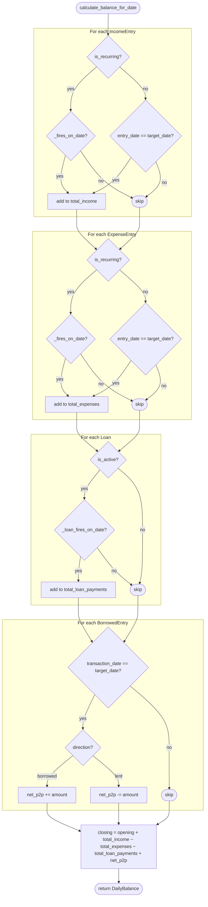

# Domain Logic

The `app/domain/` package is pure Python — no I/O, no Supabase, fully unit-testable. Services call into it with pre-fetched data.

---

## Models (`models.py`)

All domain models are frozen dataclasses (`@dataclass(frozen=True)`). Immutability prevents accidental mutation across layers.

### Enums

```python
class LoanType(StrEnum):   # mortgage | car | consumer | personal
class Direction(StrEnum):  # lent | borrowed
class PaymentType(StrEnum):# scheduled | early | partial
```

### Entities

| Class | Key Fields | Notes |
|---|---|---|
| `Loan` | `current_balance`, `annual_interest_rate`, `monthly_payment`, `payment_day`, `term_months` | Rate stored as fraction (0.1999 = 19.99%) |
| `IncomeEntry` | `amount`, `entry_date`, `is_recurring`, `recurrence_day` | |
| `ExpenseEntry` | same as income + `category` | |
| `BorrowedEntry` | `direction`, `amount`, `remaining_amount` | `remaining` = original − repayments |
| `LoanPayment` | `amount`, `principal_part`, `interest_part`, `payment_type` | |
| `DailyBalance` | `opening_balance`, `closing_balance`, `breakdown` | Computed by `balance.py` |
| `BalanceBreakdownItem` | `label`, `amount`, `is_positive` | One line in the balance breakdown |

---

## Balance Calculation (`balance.py`)

### `calculate_balance_for_date(target_date, incomes, expenses, loans, borrowed_entries, opening_balance) → DailyBalance`

Aggregates all financial events on `target_date`:

1. **One-time incomes/expenses**: included only if `entry_date == target_date`
2. **Recurring incomes/expenses**: included if their `recurrence_day` fires on `target_date` (see recurring rule below)
3. **Loan payments**: deducted if `payment_day` fires on `target_date` and loan `is_active`
4. **P2P (borrowed/lent)**: included only if `transaction_date == target_date`
   - `direction=borrowed` → positive (received money)
   - `direction=lent` → negative (paid out)

Formula:
```
closing = opening + total_income − total_expenses − total_loan_payments + net_p2p
```

### Decision Logic



### `calculate_forecast(from_date, days, ..., opening_balance) → list[DailyBalance]`

Rolls `calculate_balance_for_date` forward for `days` days. Each day's `closing_balance` becomes the next day's `opening_balance`.

### Recurring Entry Rule (`_fires_on_date`)

A recurring entry with `recurrence_day = D` fires on `target_date` when:

```python
effective_day = min(D, last_day_of_month(target_date))
fires = (target_date.day == effective_day) and (target_date >= entry.entry_date)
```

Examples:

| recurrence_day | Month | Fires on |
|---|---|---|
| 15 | any | 15th |
| 31 | January | 31st |
| 31 | February (non-leap) | 28th |
| 31 | February (leap) | 29th |
| 31 | March | 31st |

This prevents entries from being skipped in short months.

---

## Debt Optimization (`optimization.py`)

### `rank_loans_by_avalanche(loans) → list[PayoffRecommendation]`

Implements the **debt avalanche** method:

1. Filter: only loans where `is_active = True` and `current_balance > 0`
2. Sort: by `annual_interest_rate` descending (highest rate first)
3. For each loan, compute:
   - `monthly_interest_cost` = `balance × rate / 12`
   - `months_to_payoff` (annuity formula or fallback)
   - `interest_saved_vs_minimum` = estimated interest saved by paying this loan before the next one

**Why avalanche?** Paying the highest-rate loan first minimises total interest paid over the life of all debts.

### Monthly Interest Cost

```python
monthly_interest = current_balance × annual_interest_rate / 12
```

Rounded to 2 decimal places via `Decimal.quantize`.

### Months to Payoff (`_months_to_payoff`)

Uses the compound-interest annuity formula:

```
n = ⌈ −ln(1 − r·B/M) / ln(1 + r) ⌉
```

where:
- `r = annual_interest_rate / 12` (monthly rate)
- `B = current_balance`
- `M = monthly_payment`

Edge cases:
- `balance ≤ 0` → returns `0`
- `r = 0` (zero-rate loan) → returns `⌈B/M⌉`
- `r·B ≥ M` (payment doesn't cover interest) → returns `9999` (displayed as `∞`)

### `PayoffRecommendation`

```python
@dataclass(frozen=True)
class PayoffRecommendation:
    loan: Loan
    rank: int                          # 1 = pay first
    reason: str                        # human-readable explanation
    monthly_interest_cost: Decimal
    months_to_payoff: int
    interest_saved_vs_minimum: Decimal
```

---

## Testing the Domain

Domain functions have no side effects, so tests are straightforward:

```python
# tests/domain/test_balance.py
def test_recurring_day_clamped_in_february():
    income = make_income(is_recurring=True, recurrence_day=31, entry_date=date(2024, 1, 1))
    result = calculate_balance_for_date(date(2024, 2, 29), [income], [], [], [], Decimal("0"))
    assert result.total_income == income.amount

# tests/domain/test_optimization.py
def test_avalanche_highest_rate_first():
    loans = [make_loan(rate="0.10"), make_loan(rate="0.20"), make_loan(rate="0.15")]
    recs = rank_loans_by_avalanche(loans)
    assert [r.loan.annual_interest_rate for r in recs] == [Decimal("0.20"), Decimal("0.15"), Decimal("0.10")]
```

Run with: `uv run pytest tests/domain/ -v`
